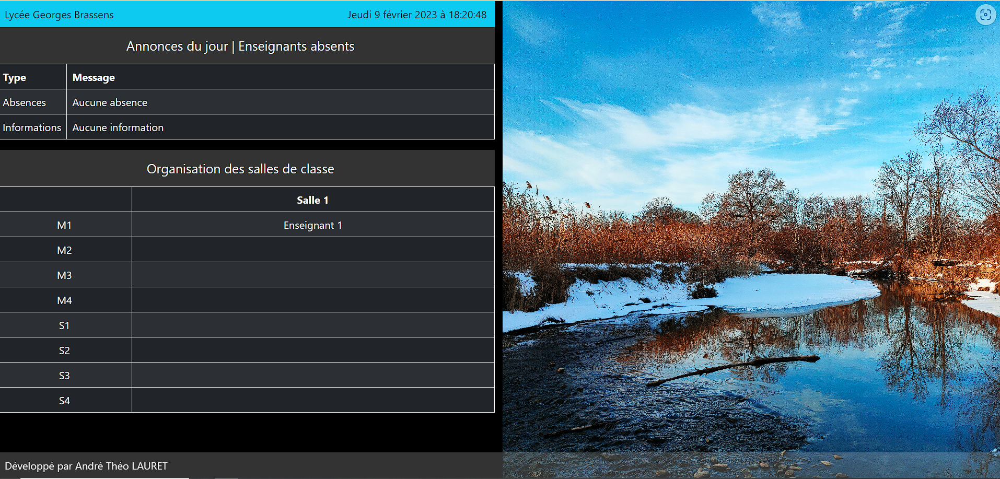

# Scovie: Digital Signage for High Schools

Scovie is an open-source digital signage system for high schools, built using Python and Django. It provides an easy-to-use interface for administrators to upload and manage multimedia content, which is then displayed on screens throughout the school.

## Features

- Easy content upload and management
- Support of classroom organization, missing teachers, images, carousel
- Support for various multimedia formats, including images and gif
- Responsive design for different screen sizes

## Requirements

- Python 3.x
- Django 3.x
- A web server to host the application

## Installation

To install Scovie, follow these steps:

1. Create the directory: `mkdir /opt/eldertek/scovie`
2. Go into the directory: `cd /opt/eldertek/scovie`
3. Clone the repository: `git clone https://github.com/eldertek/scovie && cd scovie`
4. Create virtual environment: `python -m venv virtualenv`
5. Activate virtual environment `source virtualenv/bin/activate`
6. Install the required dependencies: `pip install -r requirements.txt`
7. Run first installation: `python manage.py firstinstall`

**You need to deploy then, see below.**
## Deployment

To deploy Scovie in a production environment, follow these steps:

1. Install a production-ready web server, such as Nginx or Apache.
2. Configure the web server to serve the Django application.
3. Use a process manager, such as Gunicorn or uWSGI, to run the Django application.

## Contributing

We welcome contributions to Scovie! If you would like to contribute, please follow these steps:

1. Fork the repository
2. Create a new branch for your changes
3. Commit your changes and push to your fork
4. Submit a pull request for review

## Support

If you need help with Scovie, please open an issue on the repository. We will do our best to assist you.

Copyright (c) 2023 André Théo LAURET - All rights reserved
